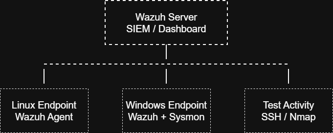

# Security Engineering Home Lab: Wazuh SIEM, Endpoint Monitoring, Vulnerability Scanning, and Hardening

## Overview

This project is a hands-on Security Engineering home lab built to demonstrate endpoint monitoring, log collection, vulnerability-style scanning, detection validation, and system hardening.

The lab uses Wazuh as the central security monitoring platform, with Linux and Windows endpoints forwarding security telemetry. I generated controlled security events, reviewed alerts, performed Nmap scans, hardened the Linux endpoint, and validated the results with before-and-after evidence.

## Lab Architecture



## Lab Components

| Component | Purpose |
|---|---|
| Wazuh Server | SIEM/security monitoring platform |
| Linux Endpoint | Monitored Ubuntu endpoint |
| Windows Endpoint | Monitored Windows endpoint |
| Sysmon | Enhanced Windows telemetry |
| Nmap | Port and service scanning |
| UFW | Linux firewall hardening |

## Tools Used

- Wazuh
- Ubuntu Linux
- Windows
- Sysmon
- Nmap
- UFW
- PowerShell
- Hyper-V

## Skills Demonstrated

- SIEM deployment
- Endpoint monitoring
- Linux log collection
- Windows event monitoring
- Sysmon telemetry
- Failed login detection
- File integrity monitoring
- Port and service discovery
- Linux firewall hardening
- Attack surface reduction
- Security documentation

## Detection and Engineering Tests

| Test | Description | Evidence |
|---|---|---|
| Failed SSH Login Detection | Generated invalid SSH login attempts against the Linux endpoint | `screenshots/03-linux-failed-ssh-alert.png` |
| File Integrity Monitoring | Monitored `/secure-data` and detected file modification | `screenshots/04-file-integrity-monitoring-alert.png` |
| Nmap Scan Before Hardening | Identified exposed services before remediation | `screenshots/05-nmap-scan-before-hardening.png` |
| Linux Hardening and After Scan | Enabled firewall controls and validated reduced exposure | `screenshots/07-nmap-scan-after-hardening.png` |
| Windows Agent Monitoring | Connected Windows endpoint to Wazuh | `screenshots/08-windows-agent-connected.png` |
| Sysmon / PowerShell Detection | Captured suspicious PowerShell-style activity | `screenshots/10-powershell-detection.png` |

## Key Findings

### Linux Endpoint Before Hardening

Nmap identified SSH exposed on the Linux endpoint:

```text
22/tcp open ssh OpenSSH 7.6p1
